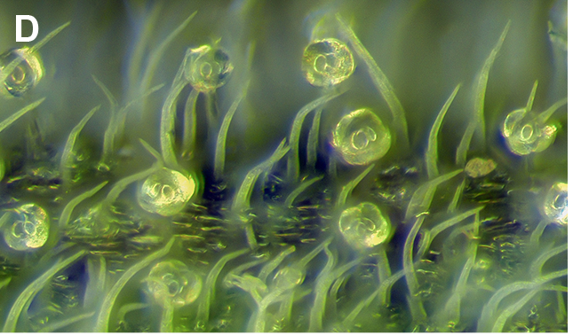

# From messy to tidy   
 - **Author**: Marc Galland (Data Science/Manager Facilitator, UvA-SILS)
 - **Research field**: Data Science
 - **Language**: R
 - **Level**: for beginners
 - **Lesson topic**: transforming a "messy" dataset into a tidy one. Plotting and performing some tests (ANOVA, post-hoc tests)

## Learning objectives
After this lesson, you will:
- know what is the tidy format and the logic behind it.
- be able to convert a "messy" data format into a "tidy" format using the `tidyr` package.
- understand how to explore a dataset based on the different experimental factors of your dataset.
- perform ANOVA and related post-hoc tests on your different experimental factors.

## Dataset
Peter and Petra are researchers that work on trichomes (little hairs) that develop at the surface of tomato leaves. They have both counted the trichomes on both upper and lower sides of the leaves of individuals of several genotypes (wild-type, mutant1,mutant2). They now want to explore the resulting data and compute some statistical tests. 

  

## Lesson outline
1. Introduction to the lesson (tidy format, examples, dataset, setup)
2. Loading the `tidyverse` library and downloading the dataset  
3. Get a first peek into the dataset: `head`, `glimpse`, `View`
4. Why is this format not handy to answer data questions?
5. Identify experimental factors from measured values: defining the key-value pairs of the `gather` function. `?gather` 
6. Transform your dataset format into the tidy format.
7. Build a few explorative plots using the `ggplot2` package from the `tidyverse` suite.
8. Subset the data to keep only the upper side of the leaf.
9. Design a one-way ANOVA model that explain the trichome count results.

# Introduction

## The tidy format

- Each variable forms a column.
- Each observation forms a row.
- Each type of observational unit forms a table.

  

## Examples (from Hadley Wickham tidy data paper)

Table 1. A wide / messy formatting:  

|              	| treatment-a 	| treatment-b 	|
|--------------	|-------------	|-------------	|
| John Smith   	| -           	| 2           	|
| Jane Doe     	| 16          	| 11          	|
| Mary Johnson 	| 3           	| 1           	|

Table 2. the same data in the tidy format:    

| name         	| treatment 	| result 	|
|--------------	|-----------	|--------	|
| John Smith   	| a         	| -      	|
| Jane Doe     	| a         	| 16     	|
| Mary Johnson 	| a         	| 3      	|
| John Smith   	| b         	| 2      	|
| Jane Doe     	| b         	| 11     	|
| Mary Johnson 	| b         	| 1      	|

## Dataset used today
The dataset is visible on the Github lesson repository. No need to download it, we'll download it together.

# Setup and prerequesites

## R and RStudio
You should have R and RStudio installed on your machine.   
Get R here: https://lib.ugent.be/CRAN/  
Get RStudio here: https://www.rstudio.com/  

## Prerequisites
You should know how to start RStudio and have an understanding of the different panels of RStudio that's all.  
This lesson is for beginners as we will perform the commands together. 

# Resources
- The tidyr cheatsheet: https://github.com/rstudio/cheatsheets/blob/master/data-import.pdf  
- The tidyr package Github page: https://github.com/tidyverse/tidyr/blob/master/README.md  
- The tidy data format: http://vita.had.co.nz/papers/tidy-data.pdf
