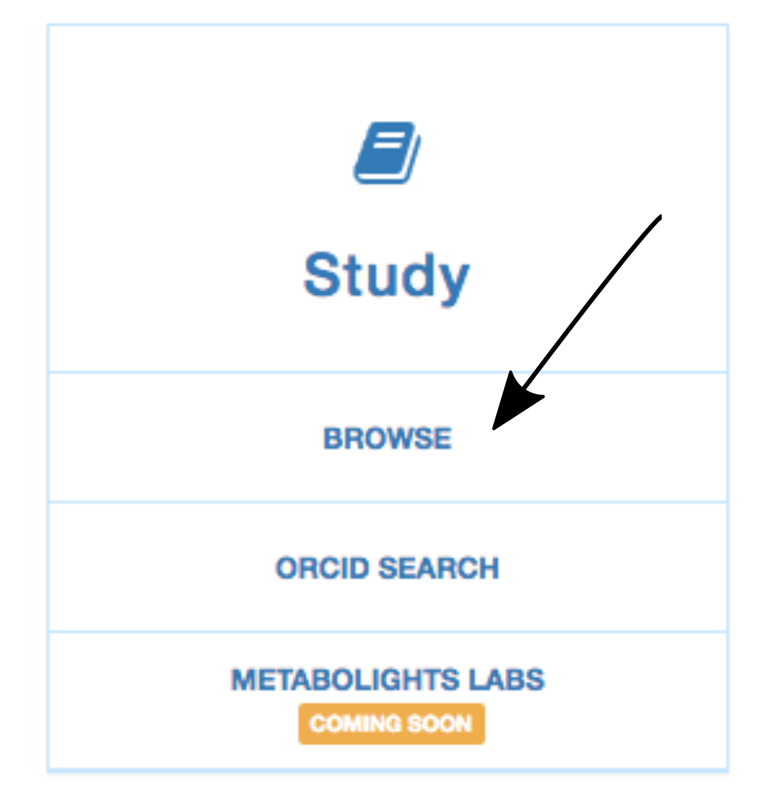
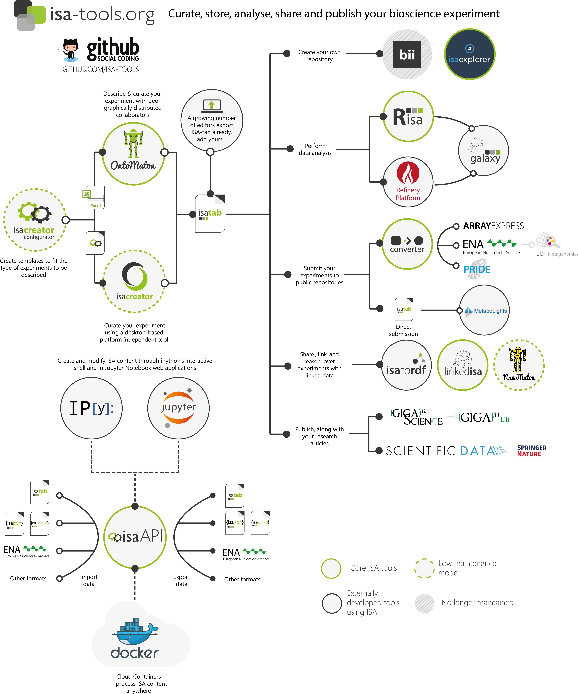

# Data about the data   
 - **Authors**: Like Fokkens (Postdoctorate fellow, SILS) & Marc Galland (Data Science/Manager Facilitator, SILS)
 - **Research topic**: Research Data Management
 - **Language**: None (Web browser)
 - **Level**: for beginners
 - **Lesson topic**: submitting your data and metadata to public repositories

## Learning objectives
After this lesson, you will:
- know the public repositories for genomic and metabolic datasets
- get an idea of what they expect in terms of data and metadata for submission
- understand the benefits of publishing datasets into public repositories

## Description
In this workshop we'll show some example of how metadata is used to retrieve relevant studies from online resources and we'll show some examples of metadata we've provided with studies we've submitted.

# The MetaboLights repository
From the [MetaboLights website](https://www.ebi.ac.uk/metabolights/):
> MetaboLights is a database for Metabolomics experiments and derived information. The database is cross-species, cross-technique and covers metabolite structures and their reference spectra as well as their biological roles, locations and concentrations, and experimental data from metabolic experiments.
MetaboLights is the recommended Metabolomics repository for a number of leading journals.

### Why would I use it?
- To store your own metabolomic research in a safe and reliable way.
- To get an accession number for your metabolomic study that you can cite in your publication (it is asked by reviewers).
- To be able to store the experimental _metadata_ along with the _raw data_.
- It is hosted by the European Bioinformatics Institute so it is a safe and reliable way to preserve and access your research.
- To collaborate with other research groups in an open but protected manner (authentification).

### What can I do with MetaboLights?
- Find metabolites and related metablomics studies by searching a wide range of associated metadata.
- Filter your search results on species, techniques and metabolites.
- Submit public or private studies.
- Receive a stable and unique accession number that can be used as a publication reference.
- Share private studies with collaborators/peer reviewers.
- Download public metabolomics studies for futher analysis.
- Retrieve molecular information from ChEBI or other linked compound databases.

### How to retrieve a dataset?
For instance, let's say your favorite organism is tomato :tomato: and you particularly like to work with a :de: research group headed by Alain Tissier. Just guessing!     
1. Go to the [MetaboLights website](https://www.ebi.ac.uk/metabolights/).
2. Under Study, click on "Browse" </a>.
3. Filter for _study_ and _mass spectrometry_ in the __Type__ box.
4. Filter for _mass spectrometry_ in the __Technology__ box.
5. Type "Solanum lycopersicum" in the __Organism__ tool.
6. Finally, select "leaf" in the __Organism part__.

All submitted data is encoded in the standardised and open ISA-Tab format.

### ISA format
ISA stands for __"Investigation"__, __"Study"__ and __"Assay"__.  
* the __Investigation__ contains all the information needed to understand the overall goals and means used in an experiment.  
* the __Study__ and __Assay__ contains the experimental steps (or sequences of events).  
* For each __Investigation__ there may be one or more Study associated with it.  
* For each __Study__ there may be one or more __Assay__.

Description and goal of the ISA format:
> Built around the 'Investigation' (the project context), 'Study' (a unit of research) and 'Assay' (analytical measurement) data model and serializations (tabular, JSON and RDF), the ISA framework helps you to provide rich description of the experimental metadata (i.e. sample characteristics, technology and measurement types, sample-to-data relationships) so that the resulting data and discoveries are reproducible and reusable.

### ISAtools and ISAcreator
To help you to
This format is required by certain databases such as MetaboLights. A toolbox called __isa-tools__ has been created to facilitate the handling and curation of experimental metadata.      
     

Within that toolbox, you can use the ISAcreator to create the ISA-tabular format for MetaboLights.  
1. Download it [here](https://github.com/downloads/ISA-tools/ISAcreator/ISAcreator-1.5.zip) for all platforms.
2. Click on `ISAcreator.jar` to launch the graphical interface.
3. Then follow the steps described in the ISAcreator user manual: http://isatab.sourceforge.net/isahelp/ch04s02.html

Alternatively, you can use the [conda package manager](https://conda.io/en/latest/) that is part of the [Anaconda distribution](https://www.anaconda.com/distribution/) that is available for Linux, macOS and Windows. In the Shell, you can run `conda create --name isatools -c bioconda isatools` to create an environment for the __isa-tools__ toolbox. Activate this environment with `source activate isatools`.

### Submitting a dataset
1.
2. Create an ISArchive file that will contain the study, validate the experimental design and create an archive file.
3. Login and submit to MetaboLights

What is this ISA-Tab format?

###

## Useful links
* [Recommended data repositories by Nature Scientific Data](https://www.nature.com/sdata/policies/repositories)
* The European Nucleotide Archive
* The MetaboLights database.
